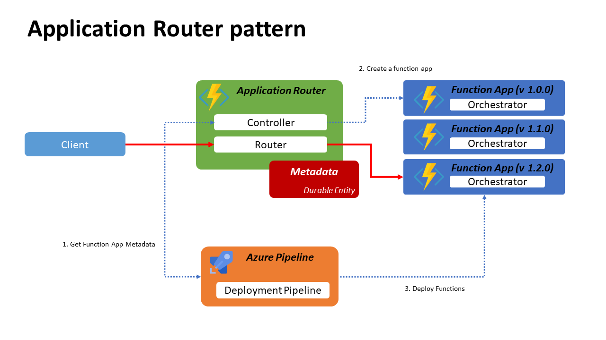

# Sample Code for Application Routing Pattern
This project is a sample implementation of Application Routing pattern on [Zero downtime deployment for Durable Functions](https://docs.microsoft.com/en-us/azure/azure-functions/durable/durable-functions-zero-downtime-deployment). 
This sample application implement Application Router with Durable Functions to support Zero Dwontime deployment. The idea of this pattern is, If you have a durable functions that has a breaking change, the application router create new Function App and start routing request to the latest function app. Running orchestrations are still runing until it finished on the old function apps. 

## Overview

1. Azure Pipeline request current function app name.
2. Application Router compare the version with latest version, if it necessary create a new function app and override the metadatqa.
3. Azure Pipeline deploy functions to the target function app.

| Resource | Description | Link |
| -------- | ----------- | ---- |
| Application Router | Manage the state of current version and function app metadata | [Router](Router/RouterFunction.cs) [Controller](Router/ControllerFunction.cs)|
| Azure pipeline | Build/Test/Deploy functions to target function app | [Azure Pipeline](azure-pipelines.yml) |
| Sample Orchestrator | Sample durable functions app | [Sample orchestrator](SampleOrchestrator/SampleOrchestrator.cs) |

## Getting Started

- [Doc](docs/getting-started.md)

## Architecture

- [Doc](docs/architecture.md)

