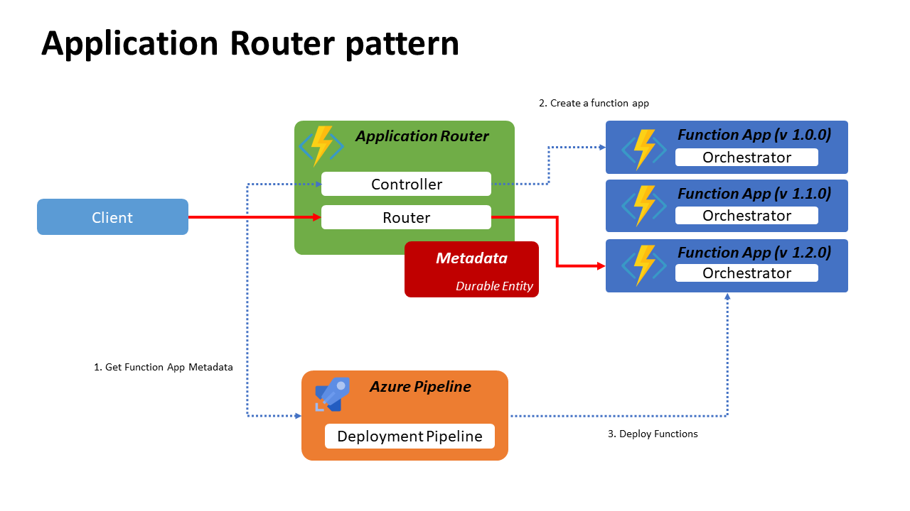

# Architecture
This article exmplain the architecture of this sample application. 

## Overview
Describe what happened under the hood. 

### Deployment

1. Azure Pipeline ask the Application Router about the target function app metadata with appName and version. 
2. Application Router refer Metadata on the [Durable Entity](https://docs.microsoft.com/en-us/azure/azure-functions/durable/durable-functions-entities) about the latest function app metadata.
3. Application Router compare the version between the version sent by Azure Pipeline and latest version from the Durable Entity. If the major/minor version are updated, it will create a new function app and update the Metadata. 
4. Application Router return the target function app metadata
5. Azure Pipeline deploy sample orchestrator to the target function app. 

### Start Orchestrator

1. Client send request to the Application Router
2. Application Router refer the Metadata to find the latest function app. (**NOTE:** the info can be stale. For more details, refer [here](https://docs.microsoft.com/en-us/azure/azure-functions/durable/durable-functions-entities#example-client-reads-an-entity-state))
3. Application Router delegate the request to the Orchestrator on the latest function app
4. Orchestrator return the response
5. Application router send the response to the client

## Code reading

Describe some entry points to read code. 

### Application Router

#### Controller 
Controller is responsible for manage the state of function apps and create/destroy the function apps. Currently, `destroy` feature is not implemented. However, for the production, you can create a timer trigger to clean up the function app that is not already finished all orchestration. For more details, refer [Query instances with filters](https://docs.microsoft.com/en-us/azure/azure-functions/durable/durable-functions-instance-management#query-instances-with-filters)

- [**Code:** ControllerFunction.cs](../Router/ControllerFunction.cs)

Durable Entity object named FunctionApp has states of [AppContext](../Router/Model/AppContext.cs) That is the metadata of the function app. The Entity has several AppContext object includes old versions. It is managed by `AppName`. The Function App also has a stated of couter. It used for prevent the conflict of the function app name.

- [**Code:** FunctionApp.cs](../Router/Entity/FunctionApp.cs)

#### Router
Router is responsible for delegate the request to the latest function app. It refer to the metadata on the Durable Entity. 

- [**Code:** RouterFunction.cs](../Router/RouterFunction.cs)

### Azure Pipeline YAML

The Azure Pipeline deploy [SampleOrchestrator](../SampleOrchestrator/SampleOrchestrator.cs) that is simple sample orchestrator functions. 

- [**Code:** azure-pipelines.yml](../azure-pipelines.yml)

**NOTE:** Usually, Deployment is implemented on Release pipeline. However, to make it simple as this project is sample project, we create it as a simple build pipeline. 

The pipeline has the following steps. 

1. Build SampleOrchestrator application.
2. Get the SampleOrchestrator App Version from csproj file.
3. Request Router.GetTargetFunctionApp with following parameters. 

| Name | Value |
| ---- | ----- |
| Name | <app_name> |
| ResourceGroup | <app_name>rg|
| FunctionAppName | <app_name> |
| Region | <region_name> |
| Version | <version_number> |

This is the same structure as [AppContext](../Router/Model/AppContext.cs). The request starts orchestration of the Router function. It is the async request. It returns query url information immediately.

4. Polling Status until it completed or timeout.
5. The status query returns functionAppName as a target function app. FunctionAppName is <app_name> + <number>. 
6. Deploy Sample to the target function app.

## Configration 
For more detail about configuration, please refer [Getting Started](getting-started.md).

## Resources

The concept of the Appliction Routing pattern, please refer to the following official documentation.

- [Zero downtime deployment for Durable Functions](https://docs.microsoft.com/en-us/azure/azure-functions/durable/durable-functions-zero-downtime-deployment)