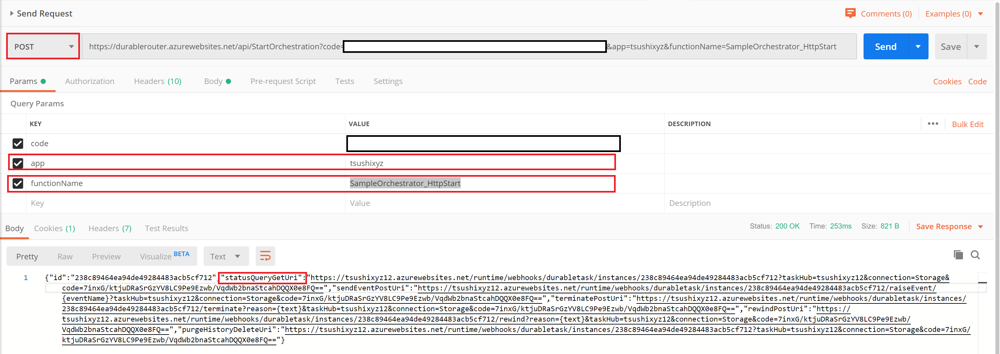
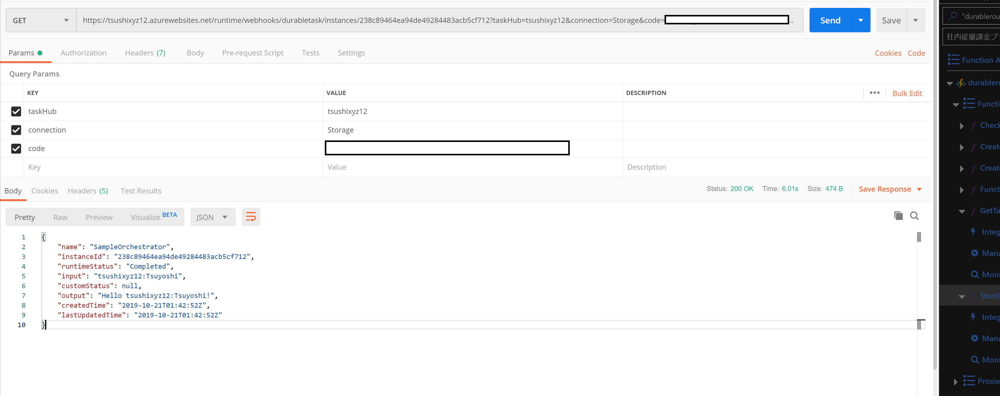

# Getting Started

In this tutorial, you can configure and execute Application Router pattern application on this repo. 

## Prerequisite

- [Azure Subscription](https://azure.microsoft.com/)
- [Azure DevOps account](https://azure.microsoft.com/en-us/services/devops/)
- [Azure CLI](https://docs.microsoft.com/en-us/cli/azure/install-azure-cli?view=azure-cli-latest)
- [Postman](https://www.getpostman.com/) 

## Configuration

### Fork this repo

Click `Fork` on your GitHub account. So that you can modify it. 

### Create function app

Open terminal or PowerShell, Login Azure using Azure Cli or Azure Portal. 

```bash
az login
```

Create a resource group for a function app to deploy router app.

```bash
az group create --name myResourceGroup --location westus
```

Craete a storage account. This storage account used for storing function app data.

```bash
az storage account create --name <storage_name> --location westus --resource-group myResourceGroup --sku Standard_LRS
```

Create a function app

```bash
az functionapp create --resource-group myResourceGroup --consumption-plan-location westus \
--name <APP_NAME> --storage-account  <STORAGE_NAME> --runtime dotnet
```

### Create service principal

This command craete a service principal with contributor. The service principal should not expose to others. 

```bash
az ad sp create-for-rbac
```

Then you see 

```
{
  "appId": "<appliction_id>",
  "displayName": "<display_name>",
  "name": "<aplliction_name>",
  "password": "<password>",
  "tenant": "<tenant_id>"
}
```
You use it on the following section.

### Configure function app

Go to Azure Portal find your function app. Then go to the function app and click `Configuration`. You see `Application settings`. Click `New application setting` and set these name/values.

| Name | Value |
| ---- | ----- |
| ClientId | <appliction_id> |
| ClientSecret | <password> |
| SubscriptionId | <subscription_id> |
| TenantId | <tenant_id> |
| WEBSITE_RUN_FROM_PACKAGE | https://github.com/TsuyoshiUshio/DurableFunctionsRouter/releases/download/1.0.0/router.zip |

You can find the value on the service principal. Refer to [Create service principal](#Create-service-principal). The `WEBSITE_RUN_FROM_PACKAGE` setting deploys router application from the Release of this repo. 

### Create Azure DevOps pipeline
- Go to `Pipelines` then Click `New`, choose `New Pipeline`. 
- Click `GitHub` on the `Where is your code?` page. 
- Select this repository at the `Select a repository` page.
- Select `Existing Azure Pipelines YAML file` at the `Configure your pipeline`. Put a Path as `/azure-pipelines.yml` at the `SElect an existing YAML file`. 
- Click `Variables` at the `Review your pipeline YAML page.
- Add the following Variables 

| Name | Value |
| ---- | ----- |
| AppName | <your_app_name>: It should be uniq with Azure Wrold Wide scope|
| Router | <router_uri>: Router's url for GetTargetFunctionApp function. See the **NOTE** |
| Subscription | <subscription_name>: Not subscription id. See the **NOTE** |

> **NOTE:**
Get the <router_uri>. Go to the function app that you deploy the router. Find `GetTargetFunctionApp` function. Click `</> Get function URL` then click `Copy` link. It copies the funciton endpoint. It is the <router_uri>.

To find the <subscription_name>, Go to the Azure Pipeline YAML page of your pipeline, find `Azure Functions` task and select it. 

Then you will see the drop down list of `Azure subscription. Select one that you want to use then click the `Authorize` button, select App type and App name. Then click `Add`. Under the hood, it create a servcie principal for you. So it might take time until you can select `AppName`. 

You see the azureSubscription value. Copy and paste it to the variables of the Pipeline. 

## Run Pipeline

Run the pipeline. This pipeline refer the `Version` section on the [SampleOrchestrator.csproj](../SampleOrchestrator/SampleOrchestrator.csproj). The default is `1.0.0`.

The first execution of this pipeline creates new function app, then deploy `SampleOrchestrator` project to the new function app. 

You can update the `Version` number and re-run the pipeline. If you update the major or minor version, the router will create a new function app. 

## Run Orchestration

Go to router function app, then find `StartOrchestration` function and click. Click `</> Get function URL` link and get the URL. This function route the request to the latest function app. 

> **NOTE** The StartOrchestration decide which function app to route basd on latest version function app. However, under the hood, this function uses Durable Entity. In this scenario it is possible to return a stale function app. However, even if it returns the stale function app, it is no problem. It is just execute old orchestration. It works fine as old version. Once new version is fully deployed and the Durable Entity is updated and reflected to the History table, it won't happen.

Open Postman, Select `POST` and paste the function URL to the URL bar. Add `app` and `functionName` parameter. `app` is the name as the `AppName` on the [Create Azure DevOps pipeline](#Create-Azure-DevOps-pipeline) section. Then click Send. 

| NAME | VALUE |
| ---- | ----- |
| URL  | <StartOperation function URL> |
| Method | POST |

_Params_

| KEY | VALUE |
| --- | ----- |
| code | <function_key> |
| app  | <app_name> |
| functionName | SampleOrchestrator_HttpStart |

This request sent to the Router, however, the response is originally coming from target function app. You will see the status url of the orchestration. 



Click the `statusQueryGetUri` then you see the result of the orchestration. 



## Local Debugging

To debug router on your local machine, put `local.settings.json` under the `Router` directory. Then start deubg on your VS or other environment. In this configuration, I use [Storage Emulator 5.9](https://docs.microsoft.com/en-us/azure/storage/common/storage-use-emulator). Start the emulator before you debug/run the router app in advance. 

_local.settings.json_

```json
{
  "IsEncrypted": false,
  "Values": {
    "AzureWebJobsStorage": "UseDevelopmentStorage=true",
    "FUNCTIONS_WORKER_RUNTIME": "dotnet",
    "ClientId": "<client_id>",
    "ClientSecret": "<client_secret>",
    "TenantId": "<tenant_id>",
    "SubscriptionId": "<subscription_id>"
  }
}
```


